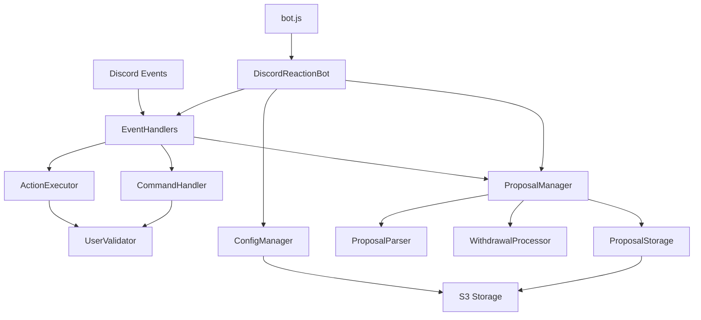

# YourBot - Discord Bot Application

This directory contains the Node.js Discord bot application that powers the YourPartyServer governance system. The bot provides automated role management, democratic proposal systems, and community governance features.

## 🚀 Quick Start - Running Manually

### Prerequisites
- Node.js 16 or higher
- Discord bot token
- AWS credentials (for S3 storage)
- Discord server with appropriate permissions

### 1. Install Dependencies
```bash
cd YourBot
npm install
```

### 2. Create Runtime Configuration
Create a `runtime.config.json` file with your settings:

```json
{
  "guildId": "YOUR_DISCORD_SERVER_ID",
  "botToken": "YOUR_BOT_TOKEN", 
  "moderatorRoleId": "YOUR_MODERATOR_ROLE_ID",
  "memberRoleId": "YOUR_MEMBER_ROLE_ID",
  "commandChannelId": "YOUR_BOT_COMMANDS_CHANNEL_ID",
  "memberCommandChannelId": "YOUR_MEMBER_COMMANDS_CHANNEL_ID",
  "s3Bucket": "your-s3-bucket-name",
  "config": [],
  "proposalConfig": {
    "policy": {
      "debateChannelId": "YOUR_POLICY_DEBATE_CHANNEL_ID",
      "voteChannelId": "YOUR_POLICY_VOTE_CHANNEL_ID", 
      "resolutionsChannelId": "YOUR_POLICY_RESOLUTIONS_CHANNEL_ID",
      "supportThreshold": 3,
      "voteDuration": 86400000,
      "formats": ["Policy"]
    }
  }
}
```

### 3. Set Environment Variables
```bash
export AWS_REGION=us-east-1
export AWS_ACCESS_KEY_ID=your_access_key
export AWS_SECRET_ACCESS_KEY=your_secret_key
```

### 4. Run the Bot
```bash
npm start
```

### 5. Test Basic Functionality
- Bot should appear online in your Discord server
- Test with `!help` in your command channels
- Check logs for any errors

## 🔧 Minimal Setup for Development

For quick development testing, create a minimal configuration:

```json
{
  "guildId": "123456789012345678",
  "botToken": "YOUR_BOT_TOKEN",
  "moderatorRoleId": "123456789012345678",
  "memberRoleId": "123456789012345678", 
  "commandChannelId": "123456789012345678",
  "memberCommandChannelId": "123456789012345678",
  "s3Bucket": "test-bucket",
  "config": [],
  "proposalConfig": {}
}
```

### Development Scripts
```bash
npm run dev     # Run with nodemon for auto-restart
npm test        # Run unit tests
npm run lint    # Check code style (when available)
```

## 📋 Getting Discord IDs

1. Enable Developer Mode in Discord (User Settings > Advanced > Developer Mode)
2. Right-click on servers, channels, roles, or users
3. Select "Copy ID" from the context menu

## 🐛 Troubleshooting

**Bot won't start:**
- Check Discord token is valid
- Verify all IDs in runtime.config.json are correct
- Ensure AWS credentials are properly set

**Permission errors:**
- Bot needs "Manage Roles" permission in Discord
- Ensure bot role is higher than roles it manages
- Check AWS S3 bucket permissions

**Commands not working:**
- Verify channel IDs are correct
- Check user has required roles
- Look for errors in console output

## 📁 Project Structure

```
YourBot/
├── src/                        # Source code modules
│   ├── DiscordReactionBot.js   # Main bot coordinator
│   ├── ConfigManager.js        # S3-backed configuration management
│   ├── EventHandlers.js        # Discord event processing
│   ├── ActionExecutor.js       # Role management actions
│   ├── CommandHandler.js       # Bot command execution
│   ├── UserValidator.js        # Permission and eligibility validation
│   ├── ProposalManager.js      # Governance system coordinator
│   ├── ProposalStorage.js      # S3-backed proposal persistence
│   ├── ProposalParser.js       # Proposal format validation
│   └── WithdrawalProcessor.js  # Resolution withdrawal handling
├── bot.js                      # Application entry point
├── package.json                # Dependencies and scripts
├── package-lock.json           # Dependency lock file
├── runtime.config.json         # Runtime configuration (generated)
└── README.md                   # This documentation
```

## 🏗️ Architecture Overview

### Design Principles

1. **Modular Architecture**: Each component has a single responsibility
2. **Event-Driven**: Responds to Discord events and user interactions
3. **Persistent Storage**: Uses S3 for configuration and data persistence
4. **Graceful Error Handling**: Continues operating despite individual failures
5. **Configurable Behavior**: Behavior controlled by external configuration

### Component Interaction



## 📄 File Documentation

### `bot.js`
**Purpose**: Application entry point and startup coordinator.

**Responsibilities**:
- Creates main bot instance
- Initiates bot initialization process
- Handles top-level error cases

**Key Code**:
```javascript
const DiscordReactionBot = require('./src/DiscordReactionBot');

// Entry point - creates and starts the Discord bot instance
// This separation allows the main bot class to handle all initialization complexity
// while keeping the entry point simple and focused on error handling
const bot = new DiscordReactionBot();
bot.initialize().catch(console.error);
```

**When to Modify**:
- Adding global error handling
- Implementing graceful shutdown procedures
- Adding application-level monitoring

---

### `src/DiscordReactionBot.js`
**Purpose**: Main bot coordinator that orchestrates all bot components and manages the Discord client connection.

**Key Responsibilities**:
- Discord client setup and management
- Module initialization and coordination
- Configuration loading and distribution
- Event handler registration
- Message pre-caching for reaction monitoring

**Important Methods**:

#### `constructor()`
Sets up Discord client with necessary intents and initializes all specialized modules.

```javascript
constructor() {
    // Discord client with necessary intents for reaction roles and proposal system
    // These specific intents allow reading reactions, messages, and managing member roles
    this.client = new Client({
        intents: [
            GatewayIntentBits.Guilds,               // Access to guild info
            GatewayIntentBits.GuildMessages,        // Read messages for commands
            GatewayIntentBits.GuildMessageReactions, // Monitor reaction events
            GatewayIntentBits.MessageContent,       // Access message text for proposal parsing
            GatewayIntentBits.GuildMembers          // Role management capabilities
        ]
    });
    
    // Initialize specialized modules - each handles a specific bot responsibility
    // This separation keeps concerns isolated and makes the code more maintainable
    this.configManager = new ConfigManager();        // S3-backed reaction configuration
    this.userValidator = new UserValidator();        // Permission and eligibility checks
    this.proposalManager = new ProposalManager(this); // Community governance system
    this.eventHandlers = new EventHandlers(this);    // Discord event processing
    this.commandHandler = new CommandHandler(this);   // Bot command execution
}
```

#### `initialize()`
Loads runtime configuration, initializes modules, and connects to Discord.

```javascript
async initialize() {
    // Load runtime configuration created during deployment
    // This file contains Discord IDs, tokens, and channel mappings specific to this deployment
    const runtimeConfig = JSON.parse(await fs.readFile('runtime.config.json', 'utf8'));
    
    // Initialize S3-backed configuration manager
    // Reaction configurations are stored in S3 for persistence across deployments
    await this.configManager.initialize(/*...*/);
    
    // Initialize community proposal/voting system
    // This enables democratic governance features for the community
    await this.proposalManager.initialize(/*...*/);
    
    // Connect to Discord and start processing events
    // Bot becomes active and responsive after this point
    await this.client.login(this.botToken);
}
```

#### `preCacheMessages()`
Pre-caches monitored messages to ensure reaction events work immediately after bot startup.

**When to Modify**:
- Adding new Discord intents or permissions
- Implementing new bot modules or services
- Changing initialization order or dependencies
- Adding health checks or monitoring

---

### `src/ConfigManager.js`
**Purpose**: Manages reaction role configurations with S3 persistence to ensure configurations survive bot restarts and deployments.

**Key Responsibilities**:
- Loading configurations from S3 on startup
- Saving configuration changes back to S3
- Validating configuration format and requirements
- Providing thread-safe access to configuration data

**Important Methods**:

#### `initialize(bucketName, guildId, defaultConfig)`
Sets up S3 storage paths and loads existing configuration.

```javascript
async initialize(bucketName, guildId, defaultConfig = []) {
    // Setup S3 storage paths - each guild gets its own configuration file
    // This allows the same bot deployment to serve multiple Discord servers
    this.bucketName = bucketName || process.env.S3_BUCKET || 'your-default-bucket';
    this.configKey = `bot/discord-bot-config-${guildId}.json`;
    
    await this.loadConfig(defaultConfig);
}
```

#### `addConfig(newConfig)`
Validates and adds new reaction role configurations.

```javascript
addConfig(newConfig) {
    // Validate required fields to prevent invalid configurations
    // Message ID and reaction emoji are minimum requirements for reaction roles
    const requiredFields = ['from', 'action'];
    
    // Prevent duplicate configurations which would cause conflicts
    // Same message + same reaction should only have one behavior
    const duplicate = this.config.find(item => 
        item.from === newConfig.from && item.action === newConfig.action
    );
}
```

#### Configuration Format
```javascript
{
  "from": "123456789012345678",    // Discord message ID to monitor
  "action": "✅",                  // Emoji to react with
  "to": "AddRole(user_id,'member')", // Action when reaction added
  "unto": "RemoveRole(user_id,'member')" // Action when reaction removed
}
```

**When to Modify**:
- Adding new configuration validation rules
- Implementing configuration migration logic
- Adding configuration backup/restore features
- Optimizing S3 access patterns

---

### `src/EventHandlers.js`
**Purpose**: Handles Discord events and routes them to appropriate processors for both reaction role events and proposal system events.

**Key Responsibilities**:
- Processing Discord reaction add/remove events
- Handling Discord message events for commands
- Routing events to appropriate specialized handlers
- Filtering bot events to prevent loops

**Important Methods**:

#### `handleReactionAdd(reaction, user)`
Processes reaction additions through both reaction role and proposal systems.

```javascript
async handleReactionAdd(reaction, user) {
    // Ignore bot reactions to prevent infinite loops and unintended role assignments
    if (this.bot.getUserValidator().isBot(user)) {
        return;
    }

    // Process reactions through both systems simultaneously for comprehensive handling
    // Legacy reaction role system for configured messages + new proposal system
    await Promise.all([
        this.handleReaction(reaction, user, 'add'),
        this.handleProposalReaction(reaction, user, 'add')
    ]);
}
```

#### `handleProposalReaction(reaction, user, type)`
Manages support reactions in debate channels and voting reactions in vote channels.

```javascript
async handleProposalReaction(reaction, user, type) {
    // Determine if this channel is part of the proposal system
    // Only process reactions in channels that are configured for proposals
    const isProposalChannel = this.bot.getProposalManager().proposalConfig && 
        Object.values(this.bot.getProposalManager().proposalConfig).some(config => 
            config.debateChannelId === message.channel.id || config.voteChannelId === message.channel.id
        );

    if (isProposalChannel) {
        // Handle ✅ reactions in debate channels for proposal support tracking
        // Support reactions determine when proposals advance to voting
        if (emoji === '✅' && isDebateChannel) {
            await this.handleSupportReaction(message);
        }
        
        // Handle ✅/❌ reactions in vote channels for actual voting
        // These reactions determine the outcome of proposals
        if ((emoji === '✅' || emoji === '❌') && isVoteChannel) {
            await this.handleVotingReaction(message, emoji, type);
        }
    }
}
```

#### `handleMessage(message)`
Processes all incoming messages for bot commands with proper filtering.

```javascript
async handleMessage(message) {
    // Ignore messages from bots to prevent command loops and spam
    if (this.bot.getUserValidator().isBot(message.author)) {
        return;
    }

    // Only process messages that start with command prefix
    // This prevents the bot from responding to normal conversation
    if (!message.content.startsWith('!')) {
        return;
    }

    // Restrict command processing to designated command channels
    // This keeps bot interactions organized and prevents spam in other channels
    const isModeratorChannel = message.channel.id === this.bot.getCommandChannelId();
    const isMemberChannel = message.channel.id === this.bot.getMemberCommandChannelId();
    
    if (isModeratorChannel || isMemberChannel) {
        await this.bot.commandHandler.handleCommand(message, isModeratorChannel);
    }
}
```

**When to Modify**:
- Adding new Discord event types
- Implementing additional event filtering logic
- Adding new reaction types or behaviors
- Integrating with external services

---

### `src/ActionExecutor.js`
**Purpose**: Executes role-based actions triggered by reactions, with safety validation and error handling.

**Key Responsibilities**:
- Parsing action strings from configurations
- Safely applying role changes to Discord users
- Validating user eligibility before performing actions
- Error handling and logging for action failures

**Action Format**:
```javascript
// Add role action
"AddRole(user_id,'role_name')"

// Remove role action  
"RemoveRole(user_id,'role_name')"
```

**Important Methods**:

#### `executeAction(action, member, guild)`
Main action executor that parses action strings and delegates to specific handlers.

```javascript
async executeAction(action, member, guild) {
    // Parse action string using regex to extract role names
    // This allows flexible configuration while maintaining security
    const addRoleMatch = action.match(/AddRole\(user_id,'(.+?)'\)/);
    const removeRoleMatch = action.match(/RemoveRole\(user_id,'(.+?)'\)/);
    
    try {
        if (addRoleMatch) {
            await this.executeAddRole(addRoleMatch[1], member, guild);
        } else if (removeRoleMatch) {
            await this.executeRemoveRole(removeRoleMatch[1], member, guild);
        }
    } catch (error) {
        console.error('Error executing action:', error);
    }
}
```

#### `executeAddRole(roleName, member, guild)`
Adds roles with validation and duplicate checking.

```javascript
async executeAddRole(roleName, member, guild) {
    // Validate user eligibility for non-member roles
    // Member role can be assigned to anyone, but other roles require validation
    if (roleName !== 'member') {
        const validation = this.bot.getUserValidator().canAct(member, this.bot.getMemberRoleId());
        if (!validation.canAct) {
            console.log(`User ${member.user.tag} cannot act: ${validation.reason}`);
            return;
        }
    }

    // Check if user already has the role to avoid unnecessary Discord API calls
    if (!member.roles.cache.has(role.id)) {
        await member.roles.add(role);
        console.log(`✅ Added role ${role.name} to ${member.user.tag}`);
    }
}
```

**Future Extensions**:
- Time-based actions (temporary roles)
- Custom action types beyond role management
- Integration with external systems
- Advanced permission checking

**When to Modify**:
- Adding new action types
- Implementing complex role hierarchies
- Adding action logging or auditing
- Integrating with external permission systems

---

### `src/CommandHandler.js`
**Purpose**: Processes bot commands with role-based access control and provides user interfaces for configuration management and proposal system interaction.

**Key Responsibilities**:
- Parsing and routing bot commands
- Enforcing role-based access control
- Providing moderator configuration interfaces
- Offering member interfaces for proposal interaction
- Formatting complex data for Discord display

**Command Categories**:

#### Moderator Commands
- `!addconfig <json>` - Add reaction role configuration
- `!removeconfig <message_id> <action>` - Remove specific configuration
- `!viewconfig` - View current reaction configurations
- `!forcevote <vote_message_id>` - Force end an active vote

#### Member Commands
- `!proposals` - View all proposals and their status
- `!activevotes` - View currently active votes
- `!voteinfo <vote_message_id>` - Get detailed info about a specific vote
- `!help` - Show available commands

**Important Methods**:

#### `handleCommand(message, isModeratorChannel)`
Main command router with permission checking.

```javascript
async handleCommand(message, isModeratorChannel = false) {
    // Determine user permissions
    const isModerator = this.bot.getUserValidator().canUseModerator(member, this.bot.getModeratorRoleId());
    const isMember = this.bot.getUserValidator().hasRole(member, this.bot.getMemberRoleId());

    // Handle commands based on channel and permissions
    if (isModeratorChannel) {
        await this.handleModeratorCommand(message, member, content, isModerator);
    } else {
        await this.handleMemberCommand(message, member, content, isMember);
    }
}
```

#### `handleViewConfig(message)`
Provides formatted display of current reaction configurations with message links.

```javascript
async handleViewConfig(message) {
    // Create a formatted display with message links
    let configDisplay = `📋 **Current Configuration** (${config.length} items):\n\n`;
    
    for (let i = 0; i < config.length; i++) {
        const cfg = config[i];
        configDisplay += `**${i + 1}.** React ${cfg.action} on message \`${cfg.from}\`\n`;
        
        // Try to find the channel for this message and create Discord link
        const foundChannel = await this.findMessageChannel(guild, cfg.from);
        if (foundChannel) {
            configDisplay += `   🔗 <https://discord.com/channels/${this.bot.getGuildId()}/${foundChannel.id}/${cfg.from}>\n`;
        }
    }
}
```

#### `handleViewProposals(message)`
Shows all proposals with status, voting information, and time remaining.

**When to Modify**:
- Adding new bot commands
- Implementing advanced permission checks
- Adding command aliases or shortcuts
- Improving user interface formatting

---

### `src/UserValidator.js`
**Purpose**: Validates user permissions and eligibility for bot actions to ensure consistent security across all bot features.

**Key Responsibilities**:
- Checking user roles and permissions
- Validating eligibility for specific actions
- Detecting and filtering bot users
- Providing detailed reasons for access denials

**Important Methods**:

#### `canAct(member, memberRoleId)`
Comprehensive eligibility check for bot actions.

```javascript
canAct(member, memberRoleId) {
    // Prevent bots from triggering actions to avoid automation loops
    if (member.user.bot) {
        return { canAct: false, reason: 'User is a bot' };
    }

    // Require member role for most bot interactions
    // This ensures only verified community members can use advanced features
    if (!member.roles.cache.has(memberRoleId)) {
        return { canAct: false, reason: 'User is not a member' };
    }

    // Respect Discord timeouts as a form of moderation
    // Timed out users shouldn't be able to bypass restrictions via bot actions
    if (member.isCommunicationDisabled()) {
        return { canAct: false, reason: 'User is currently timed out' };
    }

    return { canAct: true };
}
```

#### `canUseModerator(member, moderatorRoleId)`
Determines if user has moderator privileges for bot commands.

```javascript
canUseModerator(member, moderatorRoleId) {
    // Check for assigned moderator role
    const hasModerator = moderatorRoleId && member.roles.cache.has(moderatorRoleId);
    
    // Check for Discord manage roles permission as alternative
    // This allows server admins to use moderator commands without specific role
    const hasPermissions = member.permissions.has(PermissionFlagsBits.ManageRoles);
    
    return hasModerator || hasPermissions;
}
```

**Validation Categories**:
- **Bot Detection**: Prevents automation loops
- **Role Requirements**: Ensures proper community membership
- **Timeout Respect**: Honors Discord moderation actions
- **Permission Checking**: Validates Discord permissions

**When to Modify**:
- Adding new validation criteria
- Implementing custom permission systems
- Adding rate limiting or cooldowns
- Integrating with external user databases

---

### `src/ProposalManager.js`
**Purpose**: Manages the democratic proposal and voting system, coordinating proposal parsing, storage, voting, and resolution processing.

**Key Responsibilities**:
- Processing support reactions for proposal advancement
- Managing voting periods and automatic completion
- Coordinating proposal storage and retrieval
- Handling proposal withdrawals and resolution management

**Proposal Lifecycle**:
1. **Proposal**: User posts formatted proposal in debate channel
2. **Support**: Community reacts with ✅ to show support  
3. **Advancement**: Proposal moves to voting when threshold met
4. **Voting**: Community votes with ✅ (support) or ❌ (oppose)
5. **Resolution**: Passed proposals become official resolutions

**Important Methods**:

#### `handleSupportReaction(message, reactionCount)`
Processes support reactions to determine if proposals should advance to voting.

```javascript
async handleSupportReaction(message, reactionCount) {
    // Avoid processing proposals that are already in the system
    // Prevents duplicate tracking and processing conflicts
    if (this.storage.getProposal(messageId)) {
        return;
    }

    // Parse proposal to determine type and requirements
    // Different proposal types have different channels and thresholds
    const proposalMatch = this.parser.getProposalType(channelId, message.content);
    
    const { type, config, isWithdrawal } = proposalMatch;
    const requiredReactions = config.supportThreshold;

    // Advance proposal to voting phase when threshold is met
    // This automates the democratic process without manual intervention
    if (reactionCount >= requiredReactions) {
        await this.moveToVote(message, type, config, isWithdrawal);
    }
}
```

#### `moveToVote(originalMessage, proposalType, config, isWithdrawal)`
Creates voting message and initializes voting period.

```javascript
async moveToVote(originalMessage, proposalType, config, isWithdrawal = false) {
    // Create vote message in designated voting channel
    const voteContent = this.parser.createVoteMessage(originalMessage, proposalType, config, isWithdrawal);
    const voteMessage = await voteChannel.send(voteContent);

    // Add voting reactions
    await voteMessage.react('✅');
    await voteMessage.react('❌');

    // Store proposal data for tracking
    const proposalData = {
        originalMessageId: originalMessage.id,
        voteMessageId: voteMessage.id,
        status: 'voting',
        endTime: new Date(Date.now() + config.voteDuration).toISOString(),
        // ... additional metadata
    };

    await this.storage.addProposal(voteMessage.id, proposalData);
}
```

#### `startVotingMonitor()`
Starts background monitoring for vote completion.

```javascript
startVotingMonitor() {
    // Regular interval checking for ended votes
    // More frequent checking ensures timely vote resolution
    setInterval(async () => {
        await this.checkEndedVotes();
    }, 60 * 1000);

    // Initial check on startup to process any votes that ended while bot was offline
    setTimeout(() => this.checkEndedVotes(), 5000);
}
```

**When to Modify**:
- Adding new proposal types or categories
- Implementing complex voting rules
- Adding proposal templates or automation
- Integrating with external governance systems

---

### `src/ProposalStorage.js`
**Purpose**: S3-backed storage for proposal and voting data, maintaining proposal state across bot restarts and deployments.

**Key Responsibilities**:
- Persisting proposal data to S3 for durability
- Maintaining in-memory cache for fast access
- Providing CRUD operations for proposal management
- Handling storage errors gracefully

**Storage Model**:
```javascript
// Proposal data structure
{
  messageId: "vote_message_id",
  originalMessageId: "original_proposal_message_id", 
  authorId: "user_id",
  content: "proposal content",
  proposalType: "policy|governance|budget",
  status: "voting|passed|failed",
  startTime: "2023-01-01T00:00:00.000Z",
  endTime: "2023-01-02T00:00:00.000Z",
  yesVotes: 5,
  noVotes: 2,
  isWithdrawal: false,
  targetResolution: { /* withdrawal target info */ }
}
```

**Important Methods**:

#### `loadProposals()`
Loads all proposals from S3 into memory for fast access.

```javascript
async loadProposals() {
    try {
        // Load existing proposals from S3
        const response = await this.s3.getObject({
            Bucket: this.bucketName,
            Key: this.proposalsKey
        }).promise();
        
        // Convert S3 object back to Map for efficient lookups
        const proposalsData = JSON.parse(response.Body.toString());
        this.proposals = new Map(Object.entries(proposalsData));
    } catch (error) {
        if (error.code === 'NoSuchKey') {
            // First-time setup - no proposals exist yet
            this.proposals = new Map();
        } else {
            // S3 error - start with empty state to prevent bot failure
            console.error('Error loading proposals from S3:', error);
            this.proposals = new Map();
        }
    }
}
```

#### `saveProposals()`
Persists all proposals to S3 for durability across bot restarts.

```javascript
async saveProposals() {
    // Convert Map to object for JSON storage
    const proposalsData = Object.fromEntries(this.proposals);
    
    await this.s3.putObject({
        Bucket: this.bucketName,
        Key: this.proposalsKey,
        Body: JSON.stringify(proposalsData, null, 2),
        ContentType: 'application/json',
        Metadata: {
            'last-updated': new Date().toISOString()
        }
    }).promise();
}
```

**Query Methods**:
- `getProposal(messageId)` - Get specific proposal by ID
- `getAllProposals()` - Get all proposals for display
- `getActiveVotes()` - Get currently voting proposals
- `getProposalsByType(type)` - Get proposals of specific type

**When to Modify**:
- Adding new proposal fields or metadata
- Implementing data migration for schema changes
- Adding backup or archival features
- Optimizing storage access patterns

---

### `src/ProposalParser.js`
**Purpose**: Parses proposal messages, validates formatting, and generates vote messages with proper formatting and instructions.

**Key Responsibilities**:
- Validating proposal message formats
- Determining proposal types based on content and channel
- Generating standardized voting messages
- Extracting proposal metadata and content

**Supported Proposal Formats**:
```javascript
// Standard proposal format
**Policy**: Title of the proposal

Detailed description of what you're proposing and why it's needed.

// Withdrawal proposal format  
**Withdraw**: Reference to resolution to be withdrawn

Explanation of why this resolution should be withdrawn.
```

**Important Methods**:

#### `getProposalType(channelId, content)`
Determines proposal type based on channel and content format.

```javascript
getProposalType(channelId, content) {
    // Match channel to proposal type configuration
    for (const [type, config] of Object.entries(this.proposalConfig)) {
        if (config.debateChannelId === channelId) {
            // Validate that content follows required format for this proposal type
            // Format: **ProposalType**: content or **Withdraw**: content
            const formatRegex = new RegExp(`^\\*\\*(?:${config.formats.join('|')}|Withdraw)\\*\\*:`, 'i');
            if (formatRegex.test(content.trim())) {
                // Detect withdrawal proposals which follow special processing
                const isWithdrawal = /^\*\*Withdraw\*\*:/i.test(content.trim());
                return { type, config, isWithdrawal };
            }
        }
    }
    return null;
}
```

#### `createVoteMessage(originalMessage, proposalType, config, isWithdrawal)`
Generates formatted vote message for proposals that advance to voting.

```javascript
createVoteMessage(originalMessage, proposalType, config, isWithdrawal = false) {
    const author = originalMessage.author;
    const proposalContent = originalMessage.content;
    const endTime = Date.now() + config.voteDuration;
    
    // Create comprehensive vote message with all necessary information
    // Includes original proposal, voting instructions, and deadline
    return `🗳️ **${proposalType.toUpperCase()} ${isWithdrawal ? 'WITHDRAWAL ' : ''}VOTING PHASE**

**Proposed by:** ${author.tag}
**Type:** ${proposalType}${isWithdrawal ? ' (withdrawal)' : ''}
**Original Proposal:**
${proposalContent}

**Instructions:**
${isWithdrawal ? 
    '✅ React with ✅ to SUPPORT withdrawing this resolution\n❌ React with ❌ to OPPOSE withdrawal (keep the resolution)' :
    '✅ React with ✅ to SUPPORT this proposal\n❌ React with ❌ to OPPOSE this proposal'
}

**Voting ends:** <t:${Math.floor(endTime / 1000)}:F>

React below to cast your vote!`;
}
```

**Validation Rules**:
- Must start with proper format indicator (`**Type**:`)
- Must be posted in correct debate channel for proposal type
- Content must not be empty after format indicator
- Withdrawal proposals must reference existing resolutions

**When to Modify**:
- Adding new proposal formats or types
- Implementing rich proposal templates
- Adding proposal validation rules
- Customizing vote message formatting

---

### `src/WithdrawalProcessor.js`
**Purpose**: Handles proposal withdrawals and resolution removal, enabling democratic reversal of previous community decisions.

**Key Responsibilities**:
- Finding target resolutions for withdrawal proposals
- Matching withdrawal requests to existing resolutions
- Removing withdrawn resolutions from resolution channels
- Creating withdrawal records for transparency

**Withdrawal Process**:
1. **Parse Target**: Extract resolution reference from withdrawal proposal
2. **Search Resolutions**: Find matching resolution in resolution channel
3. **Match Content**: Use fuzzy matching to identify correct resolution
4. **Execute Withdrawal**: Remove resolution and post withdrawal notice

**Important Methods**:

#### `parseWithdrawalTarget(content, proposalType, config)`
Parses withdrawal proposal to find the target resolution to remove.

```javascript
async parseWithdrawalTarget(content, proposalType, config) {
    // Extract resolution reference from withdrawal proposal text
    // Expected format: **Withdraw**: [Resolution description/link]
    const withdrawMatch = content.match(/\*\*Withdraw\*\*:\s*(.+)/i);
    if (!withdrawMatch) {
        return null;
    }

    const withdrawalContent = withdrawMatch[1].trim();
    
    // Access the resolutions channel to search for target resolution
    const resolutionsChannel = guild.channels.cache.get(config.resolutionsChannelId);
    
    // Fetch recent messages to find the target resolution
    const messages = await resolutionsChannel.messages.fetch({ limit: 100 });
    
    for (const [messageId, message] of messages) {
        if (message.content.includes('PASSED') && message.content.includes('RESOLUTION')) {
            if (this.isMatchingResolution(message.content, withdrawalContent)) {
                return {
                    messageId: messageId,
                    channelId: resolutionsChannelId,
                    content: message.content,
                    originalContent: this.extractOriginalResolution(message.content)
                };
            }
        }
    }
    
    return null;
}
```

#### `isMatchingResolution(resolutionContent, withdrawalTarget)`
Determines if a resolution matches the withdrawal target using multiple strategies.

```javascript
isMatchingResolution(resolutionContent, withdrawalTarget) {
    // Strategy 1: Direct substring matching for exact references
    if (resolutionContent.toLowerCase().includes(withdrawalTarget.toLowerCase())) {
        return true;
    }

    // Strategy 2: Extract and compare policy text specifically
    // Focuses on the actual policy content rather than metadata
    const policyMatch = resolutionContent.match(/\*\*(?:Policy|Governance|Resolution)\*\*:\s*(.+?)(?:\n|$)/i);
    if (policyMatch) {
        const policyText = policyMatch[1].trim();
        if (policyText.toLowerCase().includes(withdrawalTarget.toLowerCase()) ||
            withdrawalTarget.toLowerCase().includes(policyText.toLowerCase())) {
            return true;
        }
    }

    // Strategy 3: Keyword overlap analysis for partial matches
    // Handles cases where withdrawal references don't exactly match resolution text
    const withdrawalWords = withdrawalTarget.toLowerCase().split(/\s+/).filter(w => w.length > 3);
    const resolutionWords = resolutionContent.toLowerCase().split(/\s+/);
    const matchCount = withdrawalWords.filter(word => resolutionWords.some(rw => rw.includes(word))).length;
    
    // Require 60% keyword overlap to minimize false matches
    if (withdrawalWords.length > 0 && matchCount / withdrawalWords.length >= 0.6) {
        return true;
    }

    return false;
}
```

#### `processWithdrawal(proposal, guild)`
Executes the withdrawal by removing the target resolution and posting notification.

```javascript
async processWithdrawal(proposal, guild) {
    // Remove the original resolution message from the resolutions channel
    // This effectively revokes the policy from active status
    const resolutionsChannel = guild.channels.cache.get(proposal.targetResolution.channelId);
    if (resolutionsChannel) {
        const targetMessage = await resolutionsChannel.messages.fetch(proposal.targetResolution.messageId);
        await targetMessage.delete();
    }

    // Post withdrawal notification for transparency
    const withdrawalContent = `🗑️ **WITHDRAWN ${proposal.proposalType.toUpperCase()} RESOLUTION**

**Withdrawn by:** <@${proposal.authorId}>
**Withdrawn on:** <t:${Math.floor(Date.parse(proposal.completedAt) / 1000)}:F>
**Final Vote:** ✅ ${proposal.finalYes} - ❌ ${proposal.finalNo}

**Original Resolution (now withdrawn):**
${proposal.targetResolution.originalContent}

**Withdrawal Proposal:**
${proposal.content}

*This resolution has been officially withdrawn and is no longer active policy.*`;

    await resolutionsChannelForNotification.send(withdrawalContent);
}
```

**Matching Strategies**:
1. **Exact Match**: Direct substring matching
2. **Policy Text**: Extract and compare policy content specifically  
3. **Keyword Overlap**: Fuzzy matching based on significant word overlap

**When to Modify**:
- Improving resolution matching algorithms
- Adding withdrawal approval workflows
- Implementing withdrawal permissions
- Adding withdrawal audit trails

---

## 🔧 Configuration Files

### `package.json`
**Purpose**: Defines Node.js project dependencies, scripts, and metadata.

**Key Dependencies**:
```json
{
  "dependencies": {
    "discord.js": "^14.14.1",    // Discord API library
    "aws-sdk": "^2.1691.0"       // AWS services integration
  },
  "scripts": {
    "start": "node bot.js",      // Production startup
    "dev": "nodemon bot.js"      // Development with auto-restart
  },
  "engines": {
    "node": ">=16.0.0"          // Minimum Node.js version
  }
}
```

### `runtime.config.json`
**Purpose**: Runtime configuration file generated during deployment containing Discord IDs, tokens, and system configuration.

**Structure**:
```json
{
  "guildId": "123456789012345678",
  "botToken": "MTI3OTQ2NzI5...",
  "moderatorRoleId": "123456789012345678", 
  "memberRoleId": "123456789012345678",
  "commandChannelId": "123456789012345678",
  "memberCommandChannelId": "123456789012345678",
  "s3Bucket": "yourpartyserver-bot-data-abc123",
  "config": [],
  "proposalConfig": {
    "policy": {
      "debateChannelId": "123456789012345678",
      "voteChannelId": "123456789012345678", 
      "resolutionsChannelId": "123456789012345678",
      "supportThreshold": 3,
      "voteDuration": 86400000,
      "formats": ["Policy"]
    }
  }
}
```

**Security Notes**:
- Contains sensitive tokens and IDs
- Generated automatically by Terraform
- Should never be committed to version control
- Recreated on each deployment

---

## 🚀 Development Workflow

### Local Development Setup

1. **Install Dependencies**:
   ```bash
   cd YourBot
   npm install
   ```

2. **Create Development Config**:
   ```json
   // runtime.config.json (for local testing)
   {
     "guildId": "YOUR_TEST_GUILD_ID",
     "botToken": "YOUR_DEV_BOT_TOKEN",
     "s3Bucket": "your-dev-bucket",
     // ... other configuration
   }
   ```

3. **Run Bot Locally**:
   ```bash
   npm run dev  # Uses nodemon for auto-restart
   ```

### Testing Features

1. **Reaction Roles**:
   - Set up test messages with reactions
   - Verify role assignment/removal
   - Test edge cases (duplicate reactions, etc.)

2. **Proposal System**:
   - Create test proposals in debate channels
   - Verify advancement to voting
   - Test voting mechanics and completion

3. **Commands**:
   - Test all bot commands as different user types
   - Verify permission checking
   - Test error handling

### Code Style Guidelines

1. **Async/Await**: Use modern async syntax throughout
2. **Error Handling**: Always wrap async operations in try/catch
3. **Logging**: Use descriptive console messages for debugging
4. **Comments**: Focus on "why" not "what" in comments
5. **Modular Design**: Keep functions focused and single-purpose

---

## 🔍 Debugging and Monitoring

### Debug Logging

Enable detailed logging for troubleshooting:

```javascript
// Add to runtime.config.json
{
  "debug": true,
  "logLevel": "verbose"
}
```

### Common Issues

1. **Bot Not Responding**: Check Discord token and permissions
2. **S3 Errors**: Verify IAM role and bucket permissions  
3. **Reaction Issues**: Ensure messages are pre-cached
4. **Permission Errors**: Check user roles and channel permissions

### Performance Monitoring

- Monitor memory usage and cache sizes
- Track Discord API rate limits
- Monitor S3 request patterns and costs
- Log response times for user commands

---

## 🔄 Deployment Integration

### Automated Deployment

The bot integrates with Terraform for automated deployment:

1. **Code Packaging**: GitHub Actions creates deployment zip
2. **S3 Upload**: Deployment artifacts uploaded to S3
3. **Instance Replacement**: Terraform replaces EC2 instance
4. **Service Restart**: New instance starts with updated code

### Health Checks

```bash
# Check service status
sudo systemctl status yourpartyserver-bot

# View logs
sudo journalctl -u yourpartyserver-bot -f

# Monitor resource usage
htop
```

### Rollback Procedures

If issues occur after deployment:

1. **Check Logs**: Identify the issue source
2. **Revert Code**: Use previous Git commit if needed
3. **Terraform Apply**: Deploy previous working version
4. **Verify Recovery**: Test bot functionality

This modular Node.js application provides a robust foundation for Discord community governance with comprehensive reaction role management, democratic proposal systems, and reliable AWS integration.