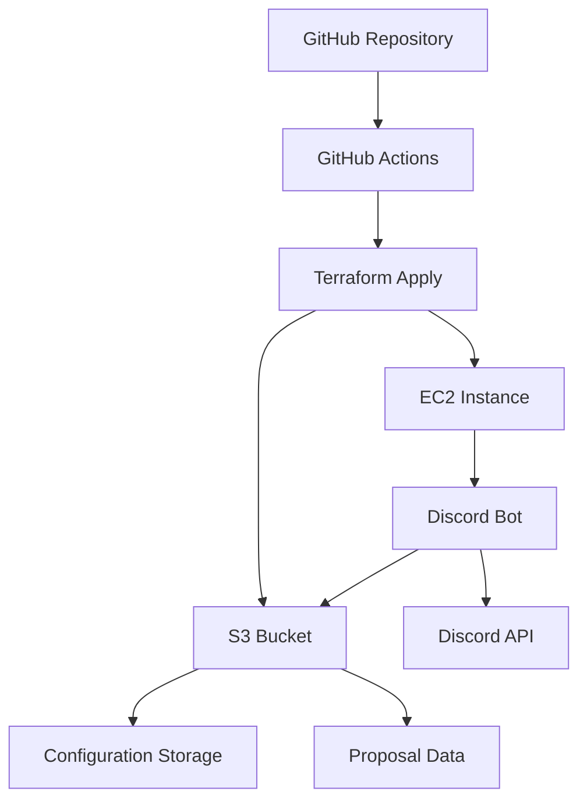
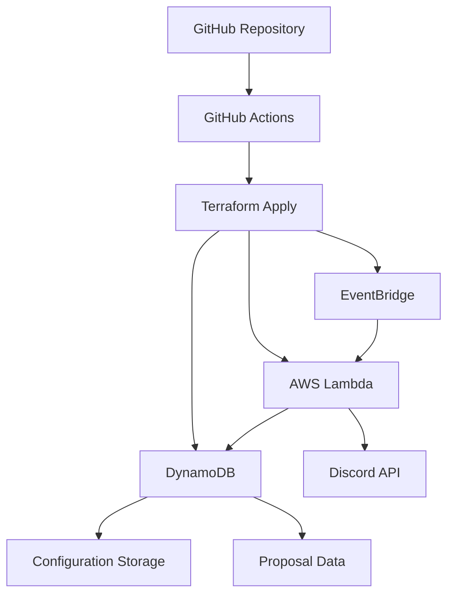

# Developer Contributing Guide

Welcome to the YourPartyServer development community! This guide will help you understand the project architecture, set up your development environment, and contribute effectively to the codebase.

## 📋 Table of Contents

- [Getting Started](#-getting-started)
- [Architecture Overview](#-architecture-overview)
- [Development Setup](#-development-setup)
- [Code Structure](#-code-structure)
- [Contributing Workflow](#-contributing-workflow)
- [Feature Development](#-feature-development)
- [Infrastructure Contributions](#-infrastructure-contributions)
- [Testing Guidelines](#-testing-guidelines)
- [Performance Optimization](#-performance-optimization)
- [Serverless Migration](#-serverless-migration)
- [Code Style & Standards](#-code-style--standards)

## 🚀 Getting Started

### Prerequisites

- **Node.js 18+**: For running the Discord bot
- **AWS Account**: For infrastructure and testing
- **Terraform**: For infrastructure management
- **Git**: For version control
- **Discord Developer Account**: For bot testing

### Quick Start

1. **Fork the Repository**
   ```bash
   git clone https://github.com/[YOUR_USERNAME]/YourDiscord.git
   cd YourDiscord
   ```

2. **Set Up Development Environment**
   ```bash
   cd YourBot
   npm install
   ```

3. **Configure Development Bot**
   - Create a test Discord server
   - Set up a test bot application in Discord Developer Portal
   - Configure your development environment (see [Development Setup](#-development-setup))

4. **Run Tests**
   ```bash
   npm test                    # Run unit tests
   npm run test:coverage       # Run tests with coverage report
   npm run test:watch          # Run tests in watch mode
   ```

## 🏗️ Architecture Overview

### Current Architecture (EC2-based)



### Target Architecture (Serverless)



### Component Responsibilities

| Component | Purpose | Technology | Migration Target |
|-----------|---------|------------|------------------|
| **DiscordReactionBot** | Main coordinator | Node.js | Lambda Handler |
| **ConfigManager** | S3 configuration | AWS SDK | DynamoDB |
| **EventHandlers** | Discord events | Discord.js | Lambda Events |
| **ProposalManager** | Governance system | Custom | DynamoDB + Step Functions |
| **ActionExecutor** | Role management | Discord.js | Lambda |
| **UserValidator** | Permission checks | Custom | Lambda Layer |

## 💻 Development Setup

### 1. Local Development Environment

Create a `.env` file in the `YourBot` directory:

```env
# Discord Configuration
DISCORD_TOKEN=your_bot_token_here
GUILD_ID=your_test_guild_id
MODERATOR_ROLE_ID=your_moderator_role_id
MEMBER_ROLE_ID=your_member_role_id
COMMAND_CHANNEL_ID=your_command_channel_id
MEMBER_COMMAND_CHANNEL_ID=your_member_command_channel_id

# AWS Configuration (for local testing)
AWS_REGION=us-east-1
S3_BUCKET=your-test-bucket
AWS_ACCESS_KEY_ID=your_access_key
AWS_SECRET_ACCESS_KEY=your_secret_key

# Proposal Configuration
PROPOSAL_CONFIG='{
  "policy": {
    "debateChannelId": "your_debate_channel_id",
    "voteChannelId": "your_vote_channel_id", 
    "resolutionsChannelId": "your_resolutions_channel_id",
    "supportThreshold": 3,
    "voteDuration": 86400000,
    "formats": ["Policy"]
  }
}'
```

### 2. Development Discord Server Setup

1. **Create Test Server**
   - Create a new Discord server for testing
   - Set up channels: #general, #bot-commands, #member-commands, #policy-debate, #policy-vote, #policy-resolutions

2. **Configure Bot Application**
   - Go to [Discord Developer Portal](https://discord.com/developers/applications)
   - Create new application
   - Create bot user
   - Get bot token
   - Set up OAuth2 with necessary permissions

3. **Required Bot Permissions**
   ```
   - Read Messages
   - Send Messages
   - Manage Roles
   - Add Reactions
   - Read Message History
   - Use External Emojis
   ```

### 3. AWS Development Resources

For development, you can use LocalStack or a dedicated AWS account:

```bash
# Install LocalStack for local AWS testing
pip install localstack
localstack start

# Or set up dedicated development AWS resources
terraform workspace new development
terraform plan -var-file="dev.tfvars"
```

## 📁 Code Structure

### Main Application (`YourBot/`)

```
YourBot/
├── src/
│   ├── DiscordReactionBot.js     # Main bot coordinator
│   ├── ConfigManager.js          # S3 configuration management
│   ├── EventHandlers.js          # Discord event processing
│   ├── ActionExecutor.js         # Role management actions
│   ├── CommandHandler.js         # Bot command processing
│   ├── UserValidator.js          # Permission validation
│   ├── ProposalManager.js        # Governance system coordinator
│   ├── ProposalStorage.js        # S3-backed proposal storage
│   ├── ProposalParser.js         # Proposal format validation
│   └── WithdrawalProcessor.js    # Resolution withdrawal system
├── bot.js                        # Application entry point
├── package.json                  # Dependencies and scripts
└── runtime.config.json          # Runtime configuration (generated)
```

### Infrastructure (`terraform/`)

```
terraform/
├── main.tf                      # Main infrastructure config
├── variables.tf                 # Input variables
├── locals.tf                    # Computed values
├── data.tf                      # Data sources
├── provider.tf                  # Provider configuration
├── bot.tf                       # EC2 and S3 resources
├── roles.tf                     # IAM roles and policies
├── channels.tf                  # Discord channel configs
├── user_data.sh.tpl            # EC2 initialization script
├── messages/                    # Channel content templates
└── images/                      # Server assets
```

### Key Design Patterns

1. **Module Separation**: Each responsibility is isolated in its own module
2. **Dependency Injection**: Bot instance is passed to modules that need it
3. **Event-Driven**: Reactions and messages trigger appropriate handlers
4. **Configuration-Driven**: Behavior controlled by S3-stored configurations
5. **Async/Await**: Modern JavaScript async patterns throughout

## 🔄 Contributing Workflow

### 1. Issue First

Before starting development, create or find an issue that describes:
- **Problem Statement**: What needs to be solved
- **Proposed Solution**: How you plan to solve it
- **Acceptance Criteria**: What defines success

### 2. Branch Strategy

```bash
# Create feature branch
git checkout -b feature/your-feature-name

# Create fix branch  
git checkout -b fix/bug-description

# Create infrastructure branch
git checkout -b infra/infrastructure-change
```

### 3. Development Process

1. **Write Tests First** (when adding new features)
2. **Implement Feature** with proper error handling
3. **Add Documentation** (code comments, README updates)
4. **Test Thoroughly** in development environment
5. **Update Infrastructure** if needed

### 4. Pull Request Process

1. **Create PR** with detailed description
2. **Link Related Issues** using keywords
3. **Request Review** from maintainers
4. **Address Feedback** promptly
5. **Ensure CI Passes** all checks

## 🎯 Feature Development

### Example: Adding a New Proposal Type

Let's walk through adding a "budget" proposal type:

#### 1. Update Configuration Schema

```javascript
// In terraform/locals.tf, add to proposal_config:
budget = {
  debateChannelId    = discord_channel.budget_debate.id
  voteChannelId      = discord_channel.budget_vote.id
  resolutionsChannelId = discord_channel.budget_resolutions.id
  supportThreshold   = 5  // Higher threshold for budget decisions
  voteDuration       = 172800000  // 48 hours for budget votes
  formats           = ["Budget", "Expense", "Allocation"]
}
```

#### 2. Create Discord Channels

```hcl
# In terraform/channels.tf
resource "discord_channel" "budget_debate" {
  name     = "budget-debate"
  guild_id = var.guild_id
  type     = 0
  topic    = "Discuss budget proposals before they go to vote"
}

resource "discord_channel" "budget_vote" {
  name     = "budget-vote" 
  guild_id = var.guild_id
  type     = 0
  topic    = "Vote on budget proposals"
}

resource "discord_channel" "budget_resolutions" {
  name     = "budget-resolutions"
  guild_id = var.guild_id
  type     = 0
  topic    = "Approved budget resolutions"
}
```

#### 3. Add Budget-Specific Validation

```javascript
// In src/ProposalParser.js, extend validation:
validateBudgetProposal(content) {
  // Check for required budget fields
  const amountMatch = content.match(/Amount:\s*\$?(\d+(?:,\d{3})*(?:\.\d{2})?)/);
  const purposeMatch = content.match(/Purpose:\s*(.+)/);
  
  if (!amountMatch || !purposeMatch) {
    throw new Error('Budget proposals must include Amount and Purpose fields');
  }
  
  return {
    amount: parseFloat(amountMatch[1].replace(/,/g, '')),
    purpose: purposeMatch[1].trim()
  };
}
```

#### 4. Add Budget-Specific Processing

```javascript
// In src/ProposalManager.js, add budget handling:
async processBudgetResolution(proposal, guild) {
  const budgetData = this.parser.validateBudgetProposal(proposal.content);
  
  // Add budget-specific processing
  // e.g., integration with accounting systems
  
  await this.moveToResolutions(proposal, guild);
  
  // Send budget notification to finance team
  const financeChannel = guild.channels.cache.get(FINANCE_CHANNEL_ID);
  if (financeChannel) {
    await financeChannel.send(`💰 New budget allocation approved: $${budgetData.amount} for ${budgetData.purpose}`);
  }
}
```

### Example: Adding a Scheduled Action System

#### 1. Design the Feature

```javascript
// New module: src/ScheduledActions.js
class ScheduledActions {
  constructor(bot) {
    this.bot = bot;
    this.actions = new Map();
    this.storage = new ScheduledActionStorage();
  }

  // Schedule an action to execute later
  async scheduleAction(actionType, executeAt, params) {
    const actionId = generateId();
    const action = {
      id: actionId,
      type: actionType,
      executeAt: executeAt,
      params: params,
      status: 'pending'
    };
    
    await this.storage.saveAction(action);
    this.actions.set(actionId, action);
    
    return actionId;
  }

  // Check for actions ready to execute
  async processScheduledActions() {
    const now = new Date();
    for (const [actionId, action] of this.actions) {
      if (action.status === 'pending' && new Date(action.executeAt) <= now) {
        await this.executeAction(action);
      }
    }
  }
}
```

#### 2. Integration Points

```javascript
// In src/ActionExecutor.js, add support for delayed execution:
async executeAction(action, member, guild, options = {}) {
  if (options.delay) {
    // Schedule for later execution
    return this.bot.scheduledActions.scheduleAction(
      'role_action',
      new Date(Date.now() + options.delay),
      { action, memberId: member.id, guildId: guild.id }
    );
  }
  
  // Immediate execution (existing code)
  // ...
}
```

## 🏗️ Infrastructure Contributions

### Adding New AWS Resources

#### 1. Define Variables

```hcl
# In terraform/variables.tf
variable "enable_cloudwatch_logs" {
  description = "Enable CloudWatch logging for the bot"
  type        = bool
  default     = true
}

variable "log_retention_days" {
  description = "CloudWatch log retention period in days"
  type        = number
  default     = 30
}
```

#### 2. Create Resources

```hcl
# In terraform/monitoring.tf
resource "aws_cloudwatch_log_group" "bot_logs" {
  count             = var.enable_cloudwatch_logs ? 1 : 0
  name              = "/aws/ec2/yourpartyserver-bot"
  retention_in_days = var.log_retention_days

  tags = {
    Name        = "YourPartyServer Bot Logs"
    Environment = terraform.workspace
  }
}

resource "aws_cloudwatch_metric_alarm" "bot_cpu_high" {
  count               = var.enable_cloudwatch_logs ? 1 : 0
  alarm_name          = "yourpartyserver-bot-cpu-high"
  comparison_operator = "GreaterThanThreshold"
  evaluation_periods  = "2"
  metric_name         = "CPUUtilization"
  namespace           = "AWS/EC2"
  period              = "300"
  statistic           = "Average"
  threshold           = "80"
  alarm_description   = "This metric monitors ec2 cpu utilization"

  dimensions = {
    InstanceId = aws_instance.bot_instance.id
  }

  alarm_actions = [aws_sns_topic.alerts[0].arn]
}
```

#### 3. Update IAM Permissions

```hcl
# In terraform/roles.tf
data "aws_iam_policy_document" "bot_cloudwatch_policy" {
  statement {
    effect = "Allow"
    actions = [
      "logs:CreateLogGroup",
      "logs:CreateLogStream", 
      "logs:PutLogEvents"
    ]
    resources = ["${aws_cloudwatch_log_group.bot_logs[0].arn}:*"]
  }
}

resource "aws_iam_role_policy" "bot_cloudwatch_policy" {
  count  = var.enable_cloudwatch_logs ? 1 : 0
  name   = "CloudWatchLogsPolicy"
  role   = aws_iam_role.bot_role.id
  policy = data.aws_iam_policy_document.bot_cloudwatch_policy.json
}
```

### Testing Infrastructure Changes

```bash
# Validate Terraform syntax
terraform validate

# Plan changes
terraform plan -var-file="test.tfvars"

# Apply to test environment
terraform workspace select test
terraform apply -var-file="test.tfvars"

# Test the changes
# ... run your tests ...

# Clean up test resources
terraform destroy -var-file="test.tfvars"
```

## 🧪 Testing Guidelines

### Unit Testing

```javascript
// tests/ConfigManager.test.js
const ConfigManager = require('../src/ConfigManager');
const AWS = require('aws-sdk-mock');

describe('ConfigManager', () => {
  let configManager;

  beforeEach(() => {
    configManager = new ConfigManager();
    AWS.mock('S3', 'getObject', { Body: '[]' });
  });

  afterEach(() => {
    AWS.restore('S3');
  });

  test('should load config from S3', async () => {
    await configManager.initialize('test-bucket', 'test-guild');
    expect(configManager.getConfig()).toEqual([]);
  });

  test('should validate config before adding', async () => {
    await configManager.initialize('test-bucket', 'test-guild');
    
    expect(() => {
      configManager.addConfig({ from: '123' }); // Missing 'action'
    }).toThrow('Config must have at least "from" and "action" fields');
  });
});
```

### Integration Testing

```javascript
// tests/integration/ProposalSystem.test.js
describe('Proposal System Integration', () => {
  let bot, testGuild, testChannel;

  beforeAll(async () => {
    // Set up test Discord environment
    bot = new DiscordReactionBot();
    await bot.initialize();
    testGuild = await createTestGuild();
    testChannel = await createTestChannel(testGuild);
  });

  test('should advance proposal to voting when threshold met', async () => {
    // Create test proposal message
    const message = await testChannel.send('**Policy**: Test proposal content');
    
    // Add support reactions
    await addReactions(message, '✅', 3);
    
    // Wait for processing
    await waitFor(5000);
    
    // Verify proposal advanced to voting
    const proposal = bot.proposalManager.getProposal(message.id);
    expect(proposal.status).toBe('voting');
  });
});
```

### End-to-End Testing

```bash
#!/bin/bash
# tests/e2e/deployment.sh

echo "Running E2E deployment test..."

# Deploy to test environment
terraform workspace select e2e-test
terraform apply -auto-approve -var-file="e2e.tfvars"

# Wait for bot to start
sleep 30

# Run bot health checks
curl -f http://$BOT_INSTANCE_IP:3000/health || exit 1

# Test basic functionality
node tests/e2e/basic-functionality.js || exit 1

# Test proposal system
node tests/e2e/proposal-system.js || exit 1

# Cleanup
terraform destroy -auto-approve -var-file="e2e.tfvars"

echo "E2E tests passed!"
```

## ⚡ Performance Optimization

### Memory Usage Optimization

```javascript
// Optimize Discord client memory usage
class OptimizedDiscordReactionBot extends DiscordReactionBot {
  constructor() {
    super();
    
    // Configure client for optimal memory usage
    this.client.options.intents = [
      // Only essential intents
      GatewayIntentBits.Guilds,
      GatewayIntentBits.GuildMessageReactions
    ];
    
    // Configure caching for memory efficiency
    this.client.options.makeCache = Options.cacheWithLimits({
      MessageManager: 100,    // Cache only recent messages
      ReactionManager: 50,    // Limit reaction cache
      UserManager: 200,       // Cache active users
    });
  }
  
  // Implement periodic cache cleanup
  startCacheCleanup() {
    setInterval(() => {
      this.cleanupOldCaches();
    }, 3600000); // Every hour
  }
  
  cleanupOldCaches() {
    const oneHourAgo = Date.now() - 3600000;
    
    // Clean old messages from cache
    this.client.channels.cache.forEach(channel => {
      if (channel.messages) {
        channel.messages.cache.sweep(
          message => message.createdTimestamp < oneHourAgo
        );
      }
    });
  }
}
```

### Database Query Optimization

```javascript
// Optimize S3 operations for proposal storage
class OptimizedProposalStorage extends ProposalStorage {
  constructor() {
    super();
    this.writeQueue = [];
    this.batchWriteInterval = 5000; // Batch writes every 5 seconds
    this.startBatchWriter();
  }
  
  // Batch multiple writes together
  async updateProposal(messageId, updates) {
    this.writeQueue.push({ messageId, updates });
    
    // Return immediately, actual write happens in batch
    const proposal = this.proposals.get(messageId);
    if (proposal) {
      Object.assign(proposal, updates);
    }
  }
  
  startBatchWriter() {
    setInterval(async () => {
      if (this.writeQueue.length > 0) {
        await this.processBatchWrites();
      }
    }, this.batchWriteInterval);
  }
  
  async processBatchWrites() {
    const batch = this.writeQueue.splice(0);
    // Process all updates in a single S3 write
    await this.saveProposals();
    console.log(`Processed ${batch.length} proposal updates in batch`);
  }
}
```

## ☁️ Serverless Migration

### Migration Roadmap

The project is planned to migrate from EC2-based deployment to serverless architecture for cost optimization and scalability.

#### Phase 1: Lambda-Ready Code Structure

```javascript
// src/handlers/DiscordEventHandler.js
exports.handler = async (event, context) => {
  const { type, data } = JSON.parse(event.body);
  
  switch (type) {
    case 'MESSAGE_REACTION_ADD':
      return await handleReactionAdd(data);
    case 'MESSAGE_REACTION_REMOVE':
      return await handleReactionRemove(data);
    case 'MESSAGE_CREATE':
      return await handleMessage(data);
    default:
      return { statusCode: 200, body: 'Event ignored' };
  }
};

async function handleReactionAdd(data) {
  const bot = await createBotInstance();
  await bot.eventHandlers.handleReactionAdd(
    data.reaction, 
    data.user
  );
  return { statusCode: 200, body: 'Processed' };
}
```

#### Phase 2: DynamoDB Integration

```javascript
// src/storage/DynamoDBProposalStorage.js
class DynamoDBProposalStorage {
  constructor() {
    this.dynamodb = new AWS.DynamoDB.DocumentClient();
    this.tableName = process.env.PROPOSALS_TABLE_NAME;
  }
  
  async getProposal(messageId) {
    const params = {
      TableName: this.tableName,
      Key: { messageId }
    };
    
    const result = await this.dynamodb.get(params).promise();
    return result.Item;
  }
  
  async updateProposal(messageId, updates) {
    const updateExpression = Object.keys(updates)
      .map(key => `#${key} = :${key}`)
      .join(', ');
      
    const expressionAttributeNames = Object.keys(updates)
      .reduce((acc, key) => ({ ...acc, [`#${key}`]: key }), {});
      
    const expressionAttributeValues = Object.keys(updates)
      .reduce((acc, key) => ({ ...acc, [`:${key}`]: updates[key] }), {});
    
    const params = {
      TableName: this.tableName,
      Key: { messageId },
      UpdateExpression: `SET ${updateExpression}`,
      ExpressionAttributeNames: expressionAttributeNames,
      ExpressionAttributeValues: expressionAttributeValues
    };
    
    await this.dynamodb.update(params).promise();
  }
}
```

#### Phase 3: Event-Driven Architecture

```hcl
# terraform/serverless.tf
resource "aws_lambda_function" "discord_event_handler" {
  filename         = "discord-bot.zip"
  function_name    = "yourpartyserver-discord-handler"
  role            = aws_iam_role.lambda_role.arn
  handler         = "handlers/DiscordEventHandler.handler"
  runtime         = "nodejs18.x"
  timeout         = 30

  environment {
    variables = {
      PROPOSALS_TABLE_NAME = aws_dynamodb_table.proposals.name
      CONFIG_TABLE_NAME    = aws_dynamodb_table.config.name
    }
  }
}

resource "aws_api_gateway_rest_api" "discord_webhook" {
  name = "yourpartyserver-webhook"
}

resource "aws_api_gateway_integration" "lambda_integration" {
  rest_api_id = aws_api_gateway_rest_api.discord_webhook.id
  resource_id = aws_api_gateway_resource.webhook.id
  http_method = aws_api_gateway_method.webhook_post.http_method

  integration_http_method = "POST"
  type                   = "AWS_PROXY"
  uri                    = aws_lambda_function.discord_event_handler.invoke_arn
}
```

### Migration Benefits

- **Cost Reduction**: ~80% cost savings vs EC2
- **Auto Scaling**: Handle traffic spikes automatically  
- **High Availability**: Built-in redundancy
- **Maintenance Free**: No server management

### Migration Challenges

- **Cold Starts**: Lambda startup latency
- **Execution Limits**: 15-minute maximum runtime
- **State Management**: Stateless execution model
- **Complexity**: More complex architecture

## 📏 Code Style & Standards

### JavaScript Style Guide

```javascript
// Use modern async/await syntax
async function processProposal(message) {
  try {
    const proposal = await parseProposal(message.content);
    await saveProposal(proposal);
    return { success: true };
  } catch (error) {
    console.error('Error processing proposal:', error);
    return { success: false, error: error.message };
  }
}

// Use descriptive variable names
const supportReactionCount = Math.max(0, reaction.count - 1);
const isWithdrawalProposal = /^\*\*Withdraw\*\*:/i.test(content);

// Document complex logic with comments
// Calculate actual user support count by excluding the bot's own reaction
// Bot automatically adds reactions to vote messages, so we subtract those
const actualSupportCount = reaction.count - (reaction.me ? 1 : 0);
```

### Error Handling Patterns

```javascript
// Always handle errors gracefully
async function executeAction(action, member, guild) {
  try {
    const result = await performAction(action, member, guild);
    console.log(`✅ Action completed: ${action} for ${member.user.tag}`);
    return result;
  } catch (error) {
    console.error(`❌ Action failed: ${action} for ${member.user.tag}:`, error);
    
    // Don't let individual action failures crash the bot
    await notifyModerators(guild, `Action failed: ${error.message}`);
    return { success: false, error: error.message };
  }
}
```

### Documentation Standards

```javascript
/**
 * Processes support reactions to determine if proposals should advance to voting
 * @param {Message} message - Discord message that received the reaction
 * @param {number} reactionCount - Number of support reactions (excluding bot)
 * @returns {Promise<void>}
 * 
 * @example
 * // When a proposal gets enough support reactions:
 * await handleSupportReaction(message, 5);
 * // Proposal advances to voting phase automatically
 */
async function handleSupportReaction(message, reactionCount) {
  // Implementation...
}
```

## 🤝 Getting Help

### Development Support

- **GitHub Discussions**: [https://github.com/DayneD89/YourDiscord/discussions] - Technical questions and architecture discussions
- **Discord Server**: [discord.gg/PeJtZa7NSB] - Real-time help and community chat
- **Issue Tracker**: [https://github.com/DayneD89/YourDiscord/issues] - Bug reports and feature requests

### Code Review Process

1. **Self Review**: Check your own code before submitting
2. **Automated Checks**: Ensure CI passes all tests
3. **Peer Review**: Get feedback from other contributors
4. **Maintainer Review**: Final approval from project maintainers

### Common Issues & Solutions

| Issue | Solution |
|-------|----------|
| Bot not responding | Check Discord token and permissions |
| S3 access denied | Verify IAM role has correct policies |
| Terraform errors | Run `terraform validate` and check syntax |
| Tests failing | Ensure test environment is properly configured |
| Memory issues | Implement caching limits and cleanup |

---

**Happy coding! 🚀**

*Join our community of developers building the future of Discord governance.*