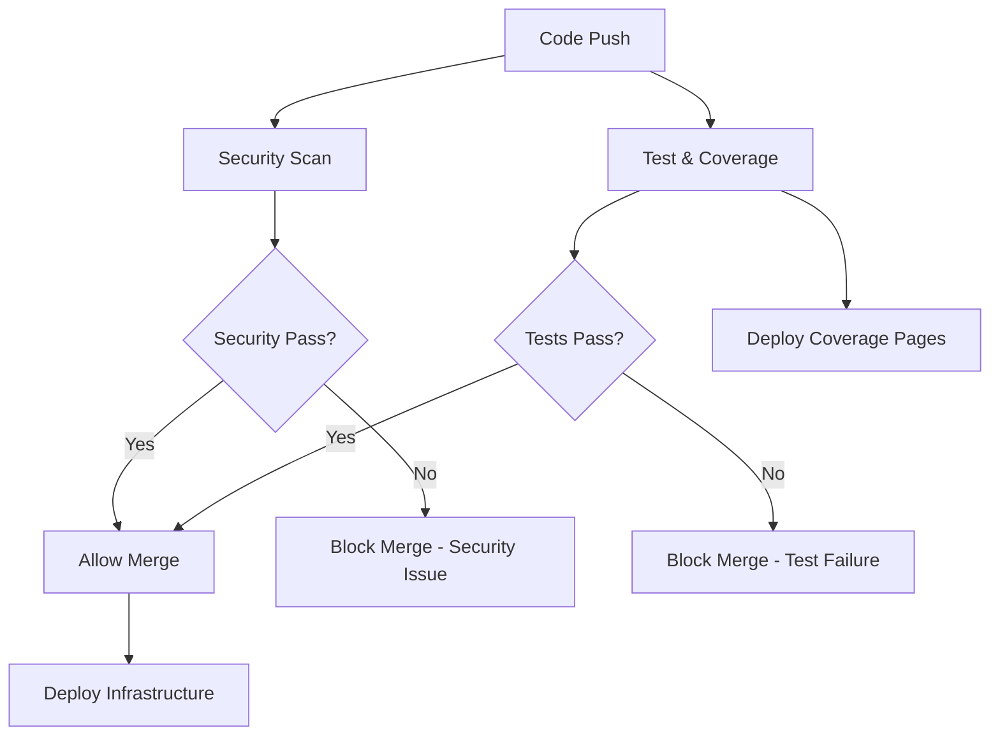

# GitHub Actions Workflows Documentation

This document explains all GitHub Actions workflows in the YourDiscord project, their purposes, triggers, and how they work together to ensure code quality and security.

## 🔄 Overview

Our CI/CD pipeline consists of three main workflows:

1. **Test & Coverage** - Quality assurance and test coverage enforcement
2. **Security Scan** - Secret detection and security validation  
3. **Infrastructure Deployment** - Automated AWS/Discord infrastructure updates

## 📊 Test & Coverage Workflow

**File**: `.github/workflows/test-and-coverage.yaml`

### Purpose
Ensures all code changes meet quality standards before merging by running comprehensive tests and enforcing coverage requirements.

### Triggers
- **Push to branches**: `main`, `features`
- **Pull requests to**: `main`
- **PR events**: `opened`, `synchronize`, `reopened`

### Jobs

#### 🧪 Unit Tests Job
**Runs on**: `ubuntu-latest`

**Steps**:
1. **Checkout code** - Gets the latest code from the repository
2. **Setup Node.js 18** - Installs Node.js with npm caching for faster builds
3. **Install dependencies** - Runs `npm ci` in the YourBot directory
4. **Run tests** - Executes Jest tests (excluding ConfigManager.test.js due to AWS mocking issues)
5. **Generate coverage** - Creates detailed HTML and LCOV coverage reports
6. **Upload to Codecov** - Sends coverage data to Codecov for tracking (optional)
7. **Coverage summary** - Adds coverage summary to GitHub Actions summary
8. **Check thresholds** - Enforces minimum coverage requirements:
   - Statements: ≥60%
   - Branches: ≥65%  
   - Functions: ≥75%
   - Lines: ≥60%
9. **PR comments** - Adds detailed coverage report as PR comment (for PRs only)
10. **Save artifacts** - Stores coverage reports for 30 days

#### 📊 Coverage Pages Job
**Runs on**: `ubuntu-latest` (only for main branch)
**Depends on**: test job

**Purpose**: Deploys live coverage dashboard to GitHub Pages

**Steps**:
1. **Generate coverage** - Creates fresh coverage reports
2. **Create beautiful site** - Builds custom HTML coverage dashboard with project branding
3. **Deploy to Pages** - Publishes to `https://dayned89.github.io/YourDiscord/`

### Coverage Requirements

#### Global Thresholds
- **Statements**: ≥60% (down from 68% for easier contribution)
- **Branches**: ≥65% (down from 71%)
- **Functions**: ≥75% (down from 84%)
- **Lines**: ≥60% (down from 68%)

#### Individual Module Requirements
Core modules maintain higher standards:
- **ActionExecutor.js**: 95-100% across all metrics
- **UserValidator.js**: 95-100% across all metrics
- **ProposalParser.js**: 90-95% across all metrics
- **EventHandlers.js**: 90-95% across all metrics

### Excluded Modules
These modules are excluded from coverage collection due to AWS mocking complexity:
- `ConfigManager.js`
- `DiscordReactionBot.js`
- `ProposalManager.js`
- `ProposalStorage.js`
- `WithdrawalProcessor.js`

## 🔒 Security Scan Workflow

**File**: `.github/workflows/security-scan.yaml`

### Purpose
Prevents accidental commit of Discord tokens, AWS credentials, and other sensitive information.

### Triggers
- **Push to branches**: `main`, `features`
- **Pull requests to**: `main`

### Jobs

#### 🕵️ Secret Detection Job
**Runs on**: `ubuntu-latest`

**Security Checks**:

1. **Discord Token Detection**
   ```regex
   (mfa\.[a-zA-Z0-9_-]{20,}|[a-zA-Z0-9_-]{23,28}\.[a-zA-Z0-9_-]{6,7}\.[a-zA-Z0-9_-]{27})
   ```
   - Detects bot tokens and MFA tokens
   - **Action**: Fails build if tokens found

2. **AWS Credentials Detection**
   ```regex
   (AKIA[0-9A-Z]{16}|aws_access_key|aws_secret)
   ```
   - Detects AWS access keys and secret patterns
   - **Action**: Fails build if credentials found

3. **General Secret Patterns**
   ```regex
   (password\s*=|secret\s*=|api_key\s*=)
   ```
   - Detects common hardcoded secrets
   - **Action**: Warning only (may be configuration examples)

4. **Suspicious Filenames**
   - Checks for files like `*.token`, `*secret*`, `*password*`
   - **Action**: Warning with reminder to check .gitignore

### Exclusions
- `.git/` directory
- `node_modules/` directory  
- `coverage/` directory
- Markdown files (for documentation examples)
- YAML files (for workflow examples)

### Security Recommendations
The workflow automatically adds security reminders to the GitHub Actions summary:
- ✅ Use environment variables for all secrets
- ✅ Never commit Discord tokens, AWS keys, or passwords
- ✅ Use GitHub Secrets for CI/CD credentials
- ✅ Review .gitignore to ensure secrets are excluded

## 🚀 Infrastructure Deployment Workflow

**File**: `.github/workflows/build_infra.yaml`

### Purpose
Automatically deploys infrastructure changes to AWS and Discord when code is pushed to main branch.

### Triggers
- **Push to**: `main` branch only
- **Manual trigger**: `workflow_dispatch`

### Jobs

#### 🏗️ Deploy Infrastructure
**Runs on**: `ubuntu-latest`

**Requirements**:
- All tests must pass (depends on test workflow)
- Security scan must pass

**Steps**:
1. **Checkout code** - Gets latest infrastructure code
2. **Configure AWS credentials** - Uses OIDC for secure authentication
3. **Setup Terraform** - Installs specified Terraform version
4. **Terraform init** - Initializes with S3 backend
5. **Terraform plan** - Shows planned infrastructure changes
6. **Terraform apply** - Applies changes to AWS and Discord
7. **Update bot** - Deploys new bot code to EC2 instance

### Security Features
- **OIDC Authentication**: No long-lived AWS credentials stored
- **Least Privilege**: IAM roles with minimal required permissions
- **State Encryption**: Terraform state encrypted in S3
- **Environment Isolation**: Separate state keys per environment

## 🔧 Workflow Dependencies



## 📋 Workflow Status Badges

Add these badges to your README to show workflow status:

```markdown
[](https://github.com/DayneD89/YourDiscord/actions/workflows/test-and-coverage.yaml)
[](https://github.com/DayneD89/YourDiscord/actions/workflows/security-scan.yaml)
[](https://dayned89.github.io/YourDiscord/)
```

## 🛠️ Troubleshooting Workflows

### Test Failures
1. **Coverage too low**: Add more tests to increase coverage
2. **ConfigManager tests failing**: These are excluded by design
3. **Node.js version issues**: Workflows use Node.js 18

### Security Scan Failures
1. **False positive**: Check if pattern is actually a secret
2. **Documentation examples**: Exclude specific files or use fake examples
3. **Legacy code**: Clean up old hardcoded values

### Deployment Failures
1. **AWS permissions**: Check IAM roles and OIDC setup
2. **Terraform state**: Ensure S3 backend is configured
3. **Discord API issues**: May need manual retry

## 📊 Monitoring and Metrics

### Available Metrics
- **Test execution time**: Track in GitHub Actions
- **Coverage trends**: View in coverage dashboard
- **Deployment frequency**: GitHub Actions history
- **Failure rates**: Workflow run statistics
- **Security scan results**: Actions summary

### Accessing Reports
- **Live Coverage**: https://dayned89.github.io/YourDiscord/
- **Workflow History**: GitHub Actions tab
- **Security Reports**: Actions summary after each run
- **Artifacts**: Download from completed workflow runs

## 🔄 Maintenance

### Regular Tasks
1. **Update dependencies**: Bump action versions quarterly
2. **Review exclusions**: Check if excluded modules can be tested
3. **Adjust thresholds**: Increase coverage requirements over time
4. **Security patterns**: Add new secret detection patterns as needed

### Version Updates
When updating workflow dependencies:
1. Test in feature branch first
2. Update one action at a time
3. Monitor for breaking changes
4. Document any configuration changes needed